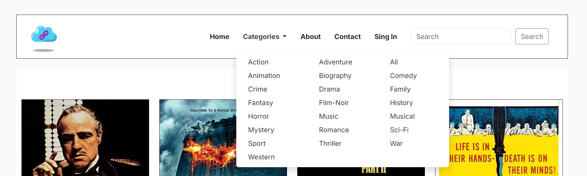
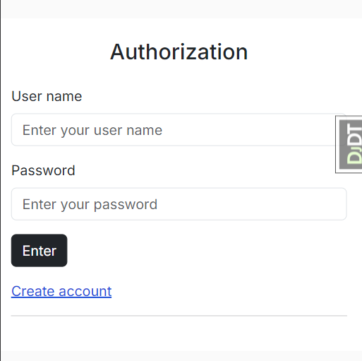
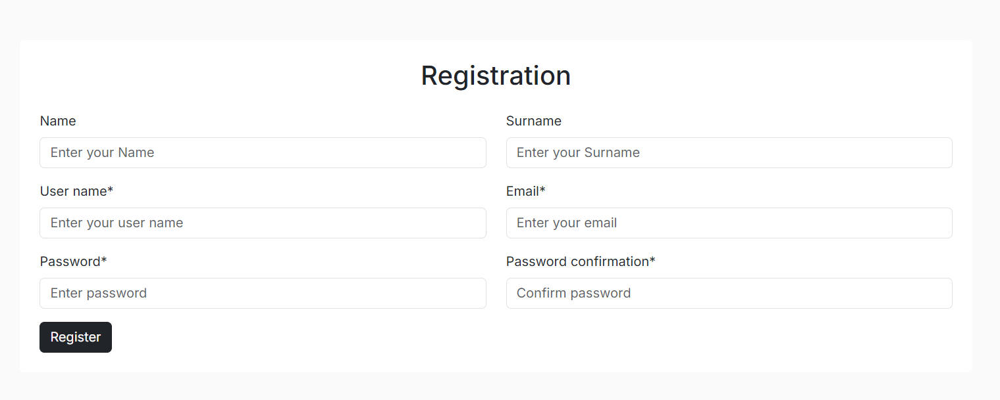

# StoreLinks web application

[Deployed Link](https://storelinks-ff093b7a4c54.herokuapp.com/)

Our goal is to help users find good content, whether it's movies, series, or music. But add it to your favorites list. So you can watch or listen to your favorite content in the future. The project was created for educational purposes.

<b>Mobile view.</b>

 

<b>Tablet view.</b>

 

<b>Desktop view.</b>

# Contents

- [Agile Methodology](#agile-methodology)
    * [Overview](#overview)
    * [MoSCoW Prioritization](#moscow-prioritization)
    * [GitHub Projects](#github-projects)
    * [EPICS](#epics)
    * [User Stories](#user-stories)
- [Website Goals and Objectives](#website-goals-and-objectives)
- [Target Audience](#target-audience)
- [Wireframes](#wireframes)
- [Database Schema](#database-schema)
- [Design Choices](#design-choices)
    * [Typography](#typography)
    * [Colour Scheme](#colour-scheme)
    * [Images](#images)
    * [Responsiveness](#responsiveness)
- [Security Measures and Protective Design](#security-measures-and-protective-design)
    * [User Authentication](#user-authentication)
    * [Password Management](#password-management)
    * [Form Validation](#form-validation)
    * [Database Security](#database-security)
- [Features](#features)
    * [Header](#header)
    * [Footer](#footer)
    * [Custom Error Pages](#custom-error-pages)
    * [User Account Pages](#user-account-pages)
    * [Profile Page](#profile-page)
- [Django Administrator page](#django-administrator-page)
- [Future Features](#future-features)
- [Deployment](#deployment)
    * [To deploy the project to Heroku](#to-deploy-the-project-to-heroku)
      * [Step 1 Create a New Heroku App](#step-1-create-a-new-heroku-app)
      * [Step 2 Configure Environment Variables](#step-2-configure-environment-variables)
      * [Step 3 Prepare the Project for Deployment](#step-3-prepare-the-project-for-deployment)
      * [Step 4 Connect Your GitHub Repository to Heroku](#step-4-connect-your-github-repository-to-heroku)
      * [Step 5 Verify Your Deployment](#step-5-verify-your-deployment)
    * [To fork the project](#to-fork-the-project)
    * [To clone the project](#to-clone-the-project)
- [Testing](#testing)
- [Technology](#technology)
    * [Languages](#languages)
    * [Frameworks](#frameworks)
    * [Python Libraries](#python-libraries)
    * [Programs](#programs)
- [Credits](#credits)
- [Disclaimer](#disclaimer)

## Agile Methodology

### Overview

[Agile methodology](https://en.wikipedia.org/wiki/Agile_software_development) is a project management approach that emphasizes flexibility, collaboration, and iterative progress towards a well-defined goal. It is particularly effective in software development where requirements and solutions evolve through the collaborative effort of self-organizing cross-functional teams. Agile methodologies aim to deliver small, incremental changes in a product to improve quality and adaptability to changing needs.

### MoSCoW Prioritization

The [MoSCoW prioritization technique](https://en.wikipedia.org/wiki/MoSCoW_method) is used to determine the importance of various features and tasks in a project. This method categorizes features into four groups: Must Have, Should Have, Could Have, and Won't Have. This helps in effective time management and ensures that the most critical functionalities are delivered first.

### GitHub Projects

Using GitHub Projects, tasks are managed and progress tracked through project boards. Each board will represent an EPIC, with columns for tasks, their statuses (To Do, In Progress, On Hold, Done, Bugs). Issue labels include the user, prioritization and sprints.

### EPICS

Epic is a large body of work that is broken down into user stories. Each Epic in this project represents a key aspect of the platform's development and ensures comprehensive coverage of the required functionalities.

- [EPIC 1](https://github.com/barkode/storelinks/issues/4)
- [EPIC 2](https://github.com/barkode/storelinks/issues/5)
- [EPIC 3](https://github.com/barkode/storelinks/issues/20)
- [EPIC 4](https://github.com/barkode/storelinks/issues/22)
- [EPIC 5](https://github.com/barkode/storelinks/issues/24)
- [EPIC 6](https://github.com/barkode/storelinks/issues/25)
- [EPIC 7](https://github.com/barkode/storelinks/issues/26)
- [EPIC 8](https://github.com/barkode/storelinks/issues/27)

### User Stories

With an emphasis on delivering a seamless user experience, the goal of this project is to provide a comprehensive platform that serves both visitors and registered users. The platform will allow for the development and maintenance of content, present developer profiles, and provide opportunities for interaction.  The following user stories outline the essential functionalities and the rationale behind them.

- As a registered user, I want to be able to log in and out of my account so that I can use the platform.
- As a registered user, I want to manage my profile so that I have control of the information held on the platform.
- As a registered user, I want to be able to comment on posts so that provide feedback to authors.
- As a registered user, I want to be able to delete and edit comments so that I can control my engagement on the platform.
- As an Administrator, I want the ability to perform all CRUD (Create, Read, Update, Delete) operations so that manually manage, control and edit content.
- As an Administrator, I want to approve comments and posts so that I can ensure content quality and appropriateness before it is published.

## Website Goals and Objectives

Website Objectives:

- User Link Storage and Management:

  Implement features that allow users to easily save, categorize, and manage their links related to movies and music.

- Integration of Social Features:

  Enable social sharing, commenting, and rating systems to encourage user interaction and community growth.

- Content Aggregation:

  Aggregate content from various trusted sources, including news, reviews, and articles, to provide a one-stop-shop for movie and music enthusiasts.

- Search and Filter Functionality:

  Develop robust search and filtering tools to help users quickly find specific information or discover new content based on their interests.

- Regular Updates and Fresh Content:

  Continuously update the site with the latest news, reviews, and trends in the movie and music industries to keep the content fresh and relevant.

- Mobile Optimization:

  Ensure the website is fully responsive and optimized for mobile devices, allowing users to access and manage their links on the go.

- Analytics and User Feedback:

  Implement analytics to track user behavior and preferences, and gather user feedback to continually improve the website’s features and content.

These goals and objectives would guide the development and operation of the website, ensuring it meets the needs of its target audience while achieving its purpose as a valuable online resource.

## Target Audience

A website for storing links and reading information about movies and music could target a diverse audience. The primary target audience may include:

- Movie and Music Enthusiasts:

  Individuals passionate about films and music, who frequently seek out new information, reviews, recommendations, and discussions about their favorite works.

- Critics and Reviewers:

  Professionals or hobbyists who write reviews and articles about movies and music may use the site to store links to sources, interviews, or news.

- Students and Researchers:

  Those conducting research in the fields of culture, film, music, or media may use the site as a tool to store and organize their materials.

- Bloggers and Content Creators:

  They can save and categorize links to resources that will be useful for content creation.

- Collectors and Enthusiasts:

  People who are passionate about collecting movies, music, or other media content may use the site to organize their digital archive.

- Curators and Event Organizers:

  Cultural event curators may store resources for preparing exhibitions, festivals, or other events related to film and music.

Overall, the target audience for the site will consist of individuals who are deeply interested in culture, seek information, and want to store it in a convenient format for future use.

[Back to top](#contents)

## Wireframes

The wireframes for the platform provide a visual representation of the layout and structure of the application. They outline the placement of key elements such as navigation menus, user profiles, content areas, and interactive features. The wireframes ensure a cohesive and intuitive user interface, guiding the design and development process. After the extensive testing was conducted, naturally there are some deviations from wireframes in the live version of the platform.

<b>Mobile Wireframes</b>

 

<b>Desktop Wireframes</b>

[Back to top](#contents)

## Database Schema

The database schema outlines the structure and relationships between key tables for the platform. The **User** table stores basic user information and authentication details. The **Profile** and **DevProfile** tables extend user details with personal information, bios, and links. The **Category** table categorizes content, while the **Post** table manages user-generated content with fields for title, content, author, and metadata. The **Comment** table handles comments on posts, including author information. These tables are designed to ensure efficient data management and robust user interactions on the platform.

This schema was generated using [drawsql.app](https://drawsql.app/).

All the movie information was taken from the [example database json file](https://github.com/toedter/movies-demo/blob/master/backend/src/main/resources/static/movie-data/movies-250.json ). Based on the data from this file, models for movies and genres were built.

<b>The database scheme that was created during project planning.</b>

 

<b>Database scheme after creating MVP.</b>

 

[Back to top](#contents)

## Design Choices

The site is made in black and white with color accents on some elements. A simple design with thin lines and not many elements on the page was chosen.
The design of the site is based on a [template that can be downloaded for free](https://bootstrapbrain.com/template/free-bike-repair-bootstrap-html-website-template-presta/).

### Typography

[Inter](https://fonts.google.com/specimen/Inter) is one of the world's most used typefaces with applications ranging from computer interfaces, advertising & airports, to NASA instrumentation & medical equipment.

### Colour Scheme

[Back to top](#contents)

### Images

All movie posters are downloaded from a remote server. The paths to these images were taken from the example database.

[Back to top](#contents)

### Responsiveness
The site was developed using the Bootstrap 5 CSS framework. Bootstrap includes six default breakpoints, sometimes referred to as grid tiers, for building responsively. These breakpoints can be customized if you’re using our source Sass files.

[Back to top](#contents)

## Security Measures and Protective Design

### User Authentication

- New user registration and existing user login were done using standard Django tools.

### Password Management
 
- Utilize Django's built-in tools for password management to securely hash and store passwords.

- Implement robust password policies to strengthen the security of user accounts.

### Form Validation

Validation of forms is performed both on the client side using the built-in capabilities of the browser (html), and on the server side using the database.

### Database Security

All important information for database access is stored in a virtual environment. The key files are stored in an .env file. The file itself is added to the list of ignored files.

[Back to top](#contents)

## Features

### Header
So I used the Bootstrap5 css framework so the site looks good on both mobile and desktop. Implemented a drop-down list for searching movies by category. There is also a search by movie titles, years of release and content.

<b>Header Desktop</b>

 

<b>Header Mobile</b>

 

### Footer

<b>Footer</b>

 

### Custom Error Pages

Made pages for errors 404, 403, 500. Used a simple design. The user is presented with an error message and a return home button.

<b>Custom error pages</b>

 

[Back to top](#contents)

## Django Administrator page

<b>Admin panel</b>

 

[Back to top](#contents)

## User Registration form

<b>User registration</b>

 

[Back to top](#contents)

## User authorization form

<b>User registration</b>

 

[Back to top](#contents)

## User profile form

<b>User registration</b>

 

[Back to top](#contents)

## Future Features

- Add the ability to add movies to your favorites list.
- Add an option for users to rate.
- Add the ability to create your own playlists.
- Add a music library.
- Add synchronization with API services.

[Back to top](#contents)

## Deployment

### To deploy the project to Heroku

Follow these steps to deploy your Django project to Heroku from VS Code:

#### **Step 1.** Create a New Heroku App
  - Access the Heroku Dashboard: Log in to your Heroku account and access the dashboard.
  - Create a New App: Click on the New button in the top-right corner of the dashboard and select Create new app from the dropdown menu.
  - App Name and Region: Enter a unique name for your app and choose a region closest to you (EU or USA). Click Create App to create the app.

#### **Step 2.** Configure Environment Variables
  - Reveal Config Vars: From the new app Settings, click Reveal Config Vars.
  - Set Environment Variables: Set your environment variables as follows:
    * `CLOUDINARY_URL`: Insert your own Cloudinary API key here.
    * `DATABASE_URL`: Insert your own ElephantSQL database URL here.
    * `DISABLE_COLLECTSTATIC`: Set to 1 for temporary purposes, and remove it for the final deployment.
    * `SECRET_KEY`: This can be any random secret key.

#### **Step 3.** Prepare the Project for Deployment
  - Create a `requirements.txt` File: This file lists all the dependencies required by your project. You can install the project's requirements using `pip3 install -r requirements.txt`. If you have your own packages installed, update the `requirements.txt` file using `pip3 freeze --local > requirements.txt`.
  - Create a `Procfile`: This file specifies the commands Heroku should run to start your app. Create the Procfile using `echo web: gunicorn app_name.wsgi > Procfile`. Replace `app_name` with the name of your primary Django app, which is the folder where `settings.py` is located.

#### **Step 4.** Connect Your GitHub Repository to Heroku
  - Automatic Deployment: Select Automatic Deployment from the Heroku app settings to automatically deploy your app whenever you push changes to your GitHub repository.
  - Manual Deployment: Alternatively, you can connect your GitHub repository to Heroku manually using the Terminal/CLI:
  - Login to Heroku: Run `heroku login -i` to log in to your Heroku account.
  - Set the Remote for Heroku: Run `heroku git:remote -a app_name` to set the remote for Heroku. Replace `app_name` with your app name.
  - Push to Heroku: After performing the standard Git add, commit, and push to GitHub, you can now type `git push heroku main` to deploy your app.

#### **Step 5.**  Verify Your Deployment
  - Open App: Once your app is deployed, you can open it by clicking on the Open App button in the Heroku dashboard. This will open your app in a web browser.
  - Verify App: Verify that your app is running correctly by checking for any errors or issues.

[Back to top](#contents)

### To fork the project

Forking the **GitHub** repository allows you to create a duplicate of a local repository. This is done so that modifications to the copy can be performed without compromising the original repository.

- Log in to **GitHub**.

- Locate the repository.

- Click to open it.

- The fork button is located on the right side of the repository menu.

- To copy the repository to your **GitHub** account, click the button.

### To clone the project

- Log in to **GitHub**.

- Navigate to the main page of the repository and click **Code**.

- Copy the **URL** for the repository.

- Open your local **IDE**.

- Change the current working directory to the location where you want the cloned directory.

- Type git clone, and then paste the **URL** you copied earlier.

- Press **Enter** to create your local clone.

_Any changes required to the website, they can be made, committed and pushed to GitHub._

[Back to top](#contents)

## Testing

Testing summary and results can be found in [TESTING.md](TESTING.md) file.

## Technology

###  Languages

- [Python](https://www.python.org/)
- [Markdown](https://en.wikipedia.org/wiki/Markdown)
- [HTML](https://developer.mozilla.org/en-US/docs/Glossary/HTML5 "HTML")
- [CSS](https://developer.mozilla.org/en-US/docs/Web/CSS "CSS")
- [JS](https://developer.mozilla.org/en-US/docs/Web/JavaScript "JS")

### Frameworks

- [Django](https://www.djangoproject.com/): Django is the main Python framework used in the development of this project. It provides a robust and scalable architecture for building web applications.
- [Bootstrap](https://getbootstrap.com/): Bootstrap is the main CSS framework used in the development of this project. With its help, it was possible to create a simple and convenient program design. Also, with its help, it was possible to realize a good look of the web application on screens of different sizes.

### Python Libraries

- [Django-allauth](https://django-allauth.readthedocs.io/en/latest/installation.html): Authentication library used to create user accounts, providing features such as registration, login, and social authentication.
- [Crispy Forms](https://django-crispy-forms.readthedocs.io/en/latest/): Used to manage Django forms, making form rendering in templates simpler and more elegant.

### Programs

- [visily](https://app.visily.ai/) - ai tool to generate wireframe images.
- [Balsamiq](https://balsamiq.com/): Wireframing tool used to generate wireframe images, allowing for quick and easy visualization of the application's layout and design.
- [Bootstrap 5](https://getbootstrap.com/docs/45/getting-started/introduction/): CSS framework used for developing responsiveness and styling, offering a wide range of pre-designed components and utilities.
- [Chrome Dev Tools](https://developer.chrome.com/docs/devtools/): Used for overall development and tweaking, including testing responsiveness, debugging, and performance profiling.
- [Cloudinary](https://cloudinary.com/): Image hosting service used to upload and manage images, providing features such as image optimization, transformation, and delivery.
- [Coolors](https://coolors.co/): Used to create a color palette, offering tools for generating, exploring, and customizing color schemes for web design.
- [Database Schema](https://dbdiagram.io/): database management tool used for creating and managing databases, providing features such as schema design, data modeling, and SQL querying.
- [Favicon](https://favicon.io/): Used to create the favicon, providing a simple tool for generating favicons for web applications.
- [Font Awesome](https://fontawesome.com/): Used for icons in the information bar, providing a wide range of high-quality, customizable icons for web development.
- [GitHub](https://github.com/): Used for version control and as an agile tool, facilitating collaborative development, code review, and project management.
- [Google Fonts](https://fonts.google.com/): Used to import and alter fonts on the page, offering a vast collection of free, open-source fonts for use in web projects.
- [Heroku](https://dashboard.heroku.com/login): Cloud-based platform used for deploying web applications. It offers easy deployment, scaling, and management of applications in the cloud environment.
- [Jshint](https://jshint.com/): Used to validate JavaScript code, helping identify potential errors and maintain code quality.
- [PEP8 Online](http://pep8online.com/): PEP8 Online is used to validate all Python code against the PEP 8 style guide, promoting code readability and consistency.
- [PostgreSQL](https://dbs.ci-dbs.net/): CI designed the database tool for this project. It is a powerful relational database management system.
- [Tables Generator](https://www.tablesgenerator.com/markdown_tables): Used to convert Excel testing tables to Markdown format, simplifying the process of creating and formatting tables for documentation purposes.
- [TOC Generator](https://ecotrust-canada.github.io/markdown-toc/): Used to generate table of contents for Markdown files, providing a convenient way to organize and navigate large documents.
- [W3C](https://www.w3.org/): Used for HTML & CSS validation, ensuring that the project's code complies with web standards and is error-free.
- [WAVE](https://webaim.org/resources/contrastchecker/): Used for accessibility testing, providing tools to check for accessibility issues such as color contrast and semantic structure.

[Back to top](#contents)

## Credits

- Feedback, advice and support:

- Insights content and visuals:

    - [Perplexity](https://www.perplexity.ai/)
    - [ChatGPT](https://chatgpt.com/)
    - [phind](https://www.phind.com/)

- Learning content:

    - [CodePen](https://codepen.io/pen/)
    - [Automated Testing Tutorial](https://www.youtube.com/watch?v=qwypH3YvMKc&list=PLbpAWbHbi5rMF2j5n6imm0enrSD9eQUaM)
    - [Django Documentation](https://docs.djangoproject.com/en/4.2/)
    - [Boostrap Docs](https://getbootstrap.com/docs/5.3/getting-started/introduction/)
    - [Hana Belay Articles](https://dev.to/earthcomfy/creating-a-django-registration-login-app-part-i-1di5)

- Debugging Issues:

    - [StackOverflow](https://stackoverflow.com/ "StackOverflow")
    - [Project Portfolio-4 channel on Slack](https://slack.com/intl/en-ie/ "Slack")
    - [Django Forum](https://forum.djangoproject.com/)

## Disclaimer

[Back to top](#contents)