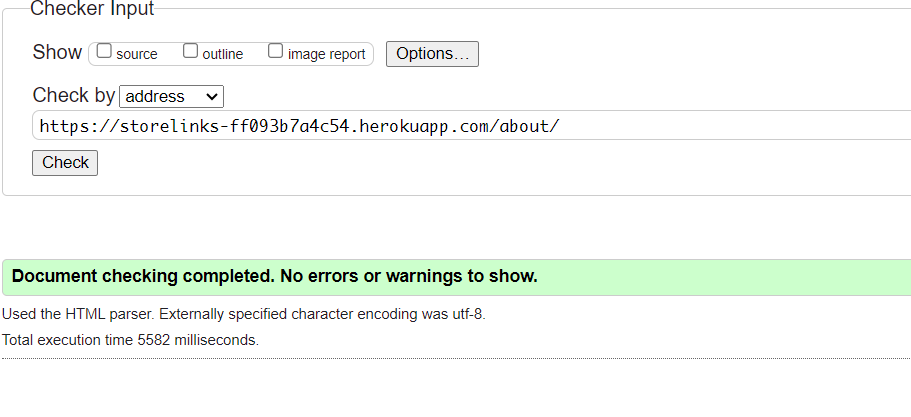
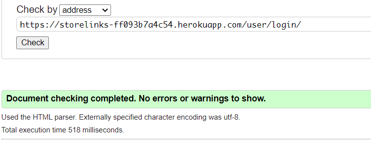
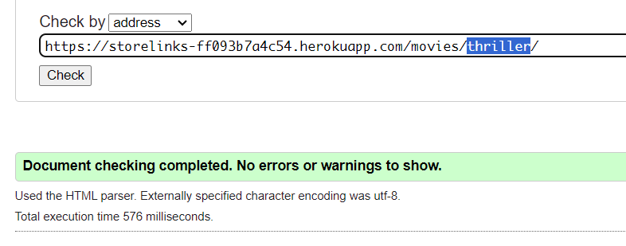
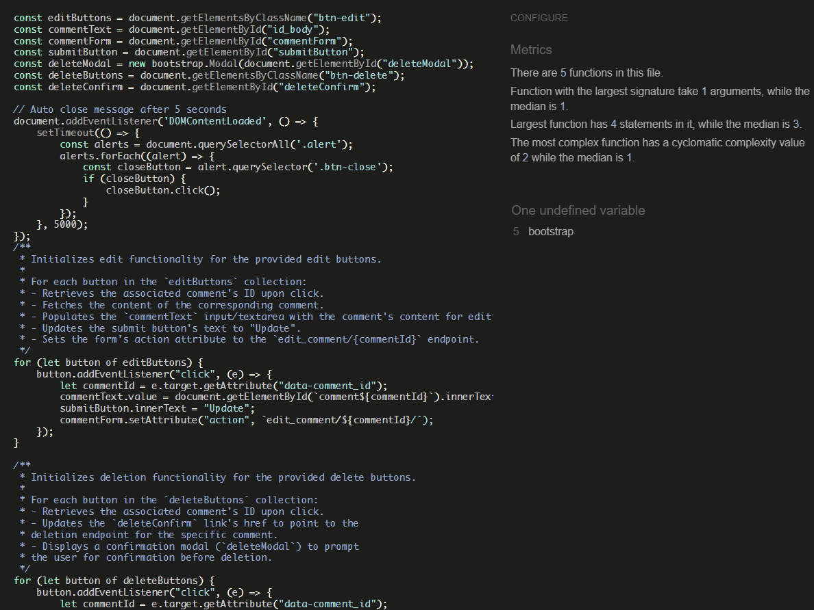
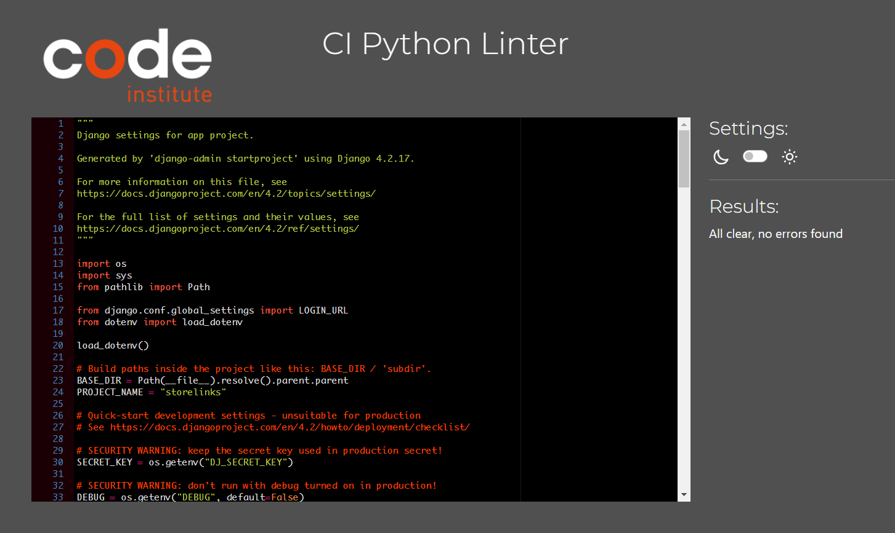

# Testing

Return back to the [README.md](README.md) file.

# Contents

<!-- TOC -->

* [Testing](#testing)
* [Contents](#contents)
    * [Responsiveness Tests](#responsiveness-tests)
    * [Code Validation](#code-validation)
        * [HTML](#html)
        * [CSS](#css)
        * [JavaScript](#javascript)
        * [Python](#python)
    * [Manual Testing](#manual-testing)
    * [Bugs](#bugs)
    * [Lighthouse Testing](#lighthouse-testing)
    * [Accessibility Testing](#accessibility-testing)

<!-- TOC -->

## Responsiveness Tests

To test the responsiveness, I have launched the website very early on. I followed the mobile-first strategy and verified
all of my modifications using the DevTools browsers for Google Chrome and Microsoft Edge. Deployed versions were tested
using the external
website [Responsive Design Checker](https://responsivedesignchecker.com/ "Responsive Design Checker").
The [Am I Responsive](https://ui.dev/amiresponsive "Am I responsive") website was another external source that was used
to obtain a unified view of different device breakpoints.

I have also used Google Chrome's Mobile Simulator extension to evaluate the responsiveness of even more specialized
devices. Device samples were examined for navigation, element alignment, content layout, and functionality concerns at
different breakpoints.

Final Test Results:

| Size | Navigation | Element Alignments | Content Placement | Functionality |
|------|------------|--------------------|-------------------|---------------|
| sm   | &check;    | &check;            | &check;           | &check;       |
| md   | &check;    | &check;            | &check;           | &check;       |
| lg   | &check;    | &check;            | &check;           | &check;       |
| xl   | &check;    | &check;            | &check;           | &check;       |
| xxl  | &check;    | &check;            | &check;           | &check;       |

[Back to top](#contents)

## Code Validation

### HTML

The recommended [HTML W3C Validator](https://validator.w3.org) to validate all the project's HTML files.

This is the process which was followed of validating an HTML file by direct input:

1. **Access the Validator**: Visit the [W3C Markup Validation Service](https://validator.w3.org/).
2. **Choose Direct Input**: Select the "Validate by Direct Input" tab.
3. **Paste Your HTML Code**: Copy HTML code and paste it into the text box.
4. **Validate**: Click the "Check" button to validate HTML.

HTML Validation Results

| File Name         | Pass | Notes                                       | View Result                 |
|-------------------|------|---------------------------------------------|-----------------------------|
| main page         | yes  | No Errors                                   |   |
| about page        | yes  | No Errors                                   |   |
| contact page      | yes  | No Errors                                   |   |
| login page        | yes  | No Errors                                   |   |
| registration page | yes  | No Errors                                   |   |
| action page       | yes  | No Errors                                   |   |
| adventure page    | yes  | No Errors                                   |   |
| all page          | yes  | No Errors                                   |   |
| animation page    | yes  | No Errors                                   |   |
| biography page    | yes  | No Errors                                   |  |
| comedy page       | yes  | No Errors                                   |  |
| drama page        | yes  | No Errors                                   |  |
| family page       | yes  | No Errors                                   |  |
| fantasy page      | yes  | No Errors                                   |  |
| film-noir page    | yes  | No Errors                                   |  |
| history page      | yes  | No Errors                                   |  |
| horror page       | yes  | No Errors                                   |  |
| music page        | yes  | No Errors                                   |  |
| musical page      | yes  | No Errors                                   |  |
| mystery page      | yes  | No Errors                                   |  |
| romance page      | yes  | No Errors                                   |  |
| sci-fi page       | yes  | No Errors                                   |  |
| sport page        | yes  | No Errors                                   |  |
| thriller page     | yes  | No Errors                                   |  |
| war page          | yes  | No Errors                                   |  |
| western page      | yes  | No Errors                                   |  |
| crime page        | yes  | Normal behavior. Error 404. Nothing to show |  |

[Back to top](#contents)

### CSS

The [W3C Jigsaw](https://jigsaw.w3.org/css-validator/) tool, provided by the W3C, enables to validate and verify the
correctness of CSS code. It ensures that your web pages adhere to W3C standards, promoting interoperability and
accessibility.

| **Tested** | **Result** | **View Result**                                                                  | **Pass** |
|------------|------------|----------------------------------------------------------------------------------|:--------:|
| CSS file   | No errors  | 

Result Summary

 |    ✅     |

### JavaScript

No major errors were found when validating JavaScript through [Jshint](https://jshint.com/).

Jshint

### Python

The python files have all been passed through [PEP8 CI Online](https://pep8ci.herokuapp.com/)

<b>PEP8 Test Results</b>

| File Name               | Pass | View Result                     |
|-------------------------|------|---------------------------------|
| settings.py             | no   |    |
| urls.py (app)           | ✅    |    |
| admin.py(movie)         | ✅    |      |
| apps.py(movie)          | ✅    |    |
| forms.py(movie)         | ✅    |   |
| models.py(movie)        | no   |   |
| urls.py(movie)          | no   |   |
| utils.py(movie)         | no   |   |
| views.py(movie)         | no   |   |
| movie_tags.py(movie)    | no   |  |
| import_movies.py(movie) | no   |  |
| fill_slug.py(movie)     | no   |  |
| admin.py(about)         | no   |  |
| forms.py(about)         | no   |  |
| models.py(about)        | ✅    |  |
| views.py(about)         | no   |  |
| urls.py(about)          | ✅    |  |
| admin.py(users)         | ✅    |  |
| views.py(users)         | no   |  |
| models.py(users)        | no   |  |
| forms.py(users)         | no   |  |
| urls.py(users)          | no   |  |
| apps.py(users)          | no   |  |

 

[Back to top](#contents)

## Manual Testing

<b>Manual Testing Results</b>

| Feature/Element                                 | Expected Outcome                                                                                                                                                                                                | Test Performed                                                                  | Result                   |
|-------------------------------------------------|-----------------------------------------------------------------------------------------------------------------------------------------------------------------------------------------------------------------|---------------------------------------------------------------------------------|--------------------------|
| **Register**                                    | Form appears correct with the correct focus and hover styles on all inputs.                                                                                                                                     | Hover/focus on each field in form.                                              | Pass                     |
| **Invalid Form**                                | User is prompted to enter missing details if any are left out.                                                                                                                                                  | Leave out fields and try to submit.                                             | Pass                     |
| **Invalid Form (email)**                        | User is prompted to enter a valid email if an invalid one is entered.                                                                                                                                           | Enter invalid email and try to submit.                                          | Pass                     |
| **Success Message**                             | When the user registers, the success message appears and redirects to the login page after 2.5 seconds.                                                                                                         | Submit valid details.                                                           | Pass                     |
| **Login**                                       | Form appears correct with the correct focus and hover styles on all inputs.                                                                                                                                     | Hover/focus on each field in form.                                              | Pass                     |
| **Invalid Form**                                | User is prompted to enter missing details if any are left out.                                                                                                                                                  | Leave out fields and try to submit.                                             | Pass                     |
| **Invalid Details**                             | User is shown a message if the login details are incorrect.                                                                                                                                                     | Enter incorrect details and try to submit.                                      | Pass                     |
| **Success Message**                             | When the user logs in successfully, a success message appears and redirects to the member area after 2.5 seconds.                                                                                               | Submit valid details.                                                           | Pass. Show other message |
| **Logout**                                      | Button displays correctly, with correct hover/focus styles.                                                                                                                                                     | Hover/focus on the button.                                                      | Pass                     |
| **Logout Successful**                           | When the user logs out successfully, a success message appears and redirects to the homepage after 2.5 seconds.                                                                                                 | Press logout button.                                                            | Pass                     |
| **Messages**                                    | Correct message appears when user registers/logs in/logs out and they disappear after 2.5 seconds.                                                                                                              | Register/log in/log out.                                                        | Pass                     |
| **Correct Custom Error Pages**                  | Custom 404 page appears when page not found. Custom 403 page appears when a forbidden error appears. Custom 500 page appears when the server is not found.                                                      | Put in wrong URL to see 404. 403 and 500 not tested.                            | pass                     |
| **Home Link**                                   | The link home works correctly sending the user back home, and the styles for hover/focus are correct.                                                                                                           | Hover/focus and press the home link.                                            | Pass                     |
| **Get To The Member Area**                      | Any logged-in users can go to the member area. If a non-member tries to go to this page, they get redirected to log in page.                                                                                    | Type in member area URL as a non-member.                                        | Pass                     |
| **Correct Movie Details**                       | For each Movie, it should have name/icons (or placeholder) and correct colors (or default ones).                                                                                                                | Check each Movie section in member area. Add new Movie with no icons or colors. | Pass                     |
| **Link in Movie Detail Section**                | Correct link to Movie detail page is displayed/works and has correct hover/focus styles.                                                                                                                        | Press/hover/focus on each Movie link.                                           | Pass                     |
| **Form Styles**                                 | Form input areas and submit button have correct focus style and submit button has correct hover style.                                                                                                          | Hover/focus/press all input areas and submit button.                            | Pass                     |
| **Invalid Form**                                | Asks to add content/Movie if none provided when submit is pressed and doesn't let user enter more than 250 characters in comment content.                                                                       | Try to submit without fields present and try to add too long comment.           | Pass                     |
| **Success Message**                             | When comment is submitted, success message appears stating it is going for approval.                                                                                                                            | Submit valid comment.                                                           | Pass                     |
| **Add Comment Whilst Not On Page**              | When User somehow accidentally puts in add comment URL without being on the member page, this will mean the form is invalid and redirect the user to the member area.                                           | Put in add comment URL whilst on a different page.                              | Pass                     |
| **Comment Displayed**                           | When pending comments are made, they are displayed in the correct area with the correct "Pending Approval" label and status.                                                                                    | Check pending comments.                                                         | Pass                     |
| **Comment Approved**                            | When the comment is approved by admin, the comment is displayed in the correct Movie area with user name label and normal style.                                                                                | Check approved comments.                                                        | Pass                     |
| **Edit Button On Comments**                     | Edit button has correct style when hovered/focused.                                                                                                                                                             | Hover/focus on edit buttons (pencil icon).                                      | No button                |
| **Press Edit Button**                           | When the edit comment buttons are pressed, the page scrolls up to the edit comment form which then changes to the edit comment form. The heading and instructions change/the Movie field set to relevant Movie. | Press edit buttons (pencil icon).                                               | Pass                     |
| **Invalid Edit Information (No Comment)**       | If the user text is deleted in the edit comment and update is pressed, the user will be prompted to add text.                                                                                                   | Edit comment and delete all words in text area.                                 | Pass                     |
| **Invalid Edit Information (Too Long Comment)** | When the user writes more than 250 characters, the user will be prompted to reduce the character count.                                                                                                         | Edit the comment and write more than 250 characters in the text area.           | Pass                     |
| **Edit Successful**                             | When the user presses update, the comment is updated in the correct Movie section and a success message appears at the top stating the comment is successfully updated.                                         | Update a comment.                                                               | Pass                     |
| **Updating Comment Whilst Not On The Page**     | When the user somehow accidentally puts in the edit comment URL without being on the member page, this will mean the form is invalid and redirect the user to the member area.                                  | Put in the edit comment URL whilst on a different page.                         | Pass                     |
| **Admin Area Access**                           | Only superusers can access this area; normal users are prevented from accessing the page and redirected to log in.                                                                                              | Type in the admin URL as a non-superuser.                                       | Pass                     |
| **Change Movie Details**                        | When the Movie details are changed in the admin area, it is updated in the correct section and success message is shown when updated.                                                                           | Edit Movie details.                                                             | Pass                     |
| **Delete Movie**                                | When the delete button is pressed, a modal is shown with a warning message to ask if                                                                                                                            |                                                                                 |                          |

 

[Back to top](#contents)

## Bugs

There are several runs in the project that could not be fixed in time.
The styles on the form for adding comments are broken.
The list of comments made by the user is not displayed.
When logging in, a message appears that the comment is being viewed.

## Lighthouse Testing

<b>Lighthouse Test Results. Desktop</b>

 

<b>Lighthouse Test Results. Mobile</b>

 

[Back to top](#contents)

## Accessibility Testing

Although, accessibility scores were high on Lighthouse, I have retested the page.
[WAVE](https://wave.webaim.org/) online tool was used to check terminal colour contrast. All tests were passed. However,
it should be noted that logo may return contrast error depending on browser and operating system.

While building the application, the general principles of accessibility were adhered to:

- Using clear instructions
- Validating inputs before moving on to the next step
- Testing the page to make sure it does not affect performance from user input
- Using ARIA labels
  Wave made a few comments and found a few mistakes.

[Back to top](#contents)